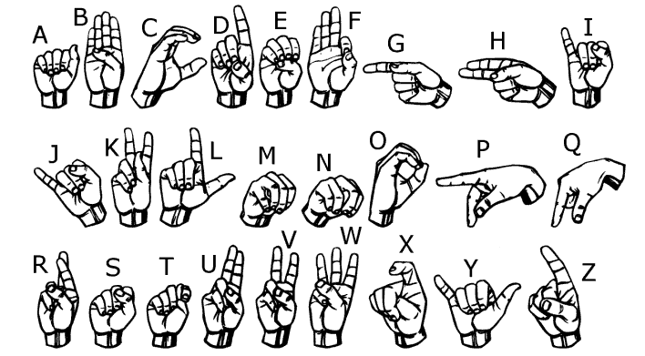

# Visual Voice: Real-Time Hand Gesture Recognition

**Visual Voice** is a real-time computer vision application that translates American Sign Language (ASL) finger-spelling into text. Built with Python, OpenCV, MediaPipe, and TensorFlow, it provides an intuitive interface for communication through hand gestures.

The system uses a custom-trained LSTM model to recognize static hand gestures corresponding to letters of the alphabet. It features an intelligent sentence-building engine that relies on gesture stability and timing to create a seamless and natural user experience, filtering out accidental or flickering detections.

---

## ✨ Features

- **Real-Time Gesture Recognition:** Translates hand gestures to text instantly using your webcam.
- **Intelligent Sentence Builder:**
  - **Stability Detection:** A gesture must be held steadily to be registered, preventing flickering and accidental inputs.
  - **Confidence Thresholding:** Ignores predictions that fall below a set confidence level, increasing reliability.
  - **Smart Cooldown:** Prevents the same letter from being added multiple times in a row unintentionally.
- **Intuitive User Interface (PyQt5):**
  - Live webcam feed with rich visual feedback, including hand landmarks and bounding boxes.
  - A dedicated text area to display the constructed sentence.
  - Controls for copying text, backspace, and clearing the sentence.
- **Custom-Trained Model:** Includes a pre-trained Keras/TensorFlow Lite model for 27 gesture classes (A-Z and SPACE).
- **Extensible:** The included data logging script and training notebook make it easy to add new gestures or improve the existing model.

---

## 🤟 ASL Alphabet Reference

The model is trained to recognize the following 26 letters of the American Sign Language alphabet and a gesture for 'SPACE'.

<p align="center">
  
</p>

---

## 🛠️ How It Works

The application follows a simple yet powerful pipeline:

1. **Camera Input:** The system captures video from your webcam using OpenCV.
2. **Hand Tracking:** [MediaPipe Hands](https://mediapipe.dev/solutions/hands) detects and tracks the 21 keypoints of the user's hand in real-time.
3. **Landmark Preprocessing:** The raw keypoint coordinates are normalized and processed to make them invariant to hand position, scale, and rotation. This ensures the model focuses only on the gesture's shape.
4. **Gesture Classification:** The preprocessed landmarks are fed into a trained TensorFlow Lite LSTM model, which classifies the gesture into one of the 27 predefined classes (A-Z, SPACE).
5. **Sentence Construction:** An intelligent engine analyzes the stream of predicted gestures. It uses a combination of gesture stability (holding a sign for a set duration) and a cooldown timer to decide when to append a character to the sentence.
6. **UI Display:** The recognized characters are displayed in a user-friendly interface built with PyQt5, allowing for easy reading, copying, and editing.

---

## 🚀 Getting Started

Follow these instructions to get a copy of the project up and running on your local machine.

### Prerequisites

You need Python 3.8+ installed on your system. You can check your Python version by running:

```bash
python --version
```

### Installation

1. **Clone the Repository**

   ```bash
   git clone https://github.com/ishabrato/Visual-Voice && cd Visual-Voice
   ```
2. **Create and Activate a Virtual Environment** (Recommended)

   **For Windows:**

   ```bash
   python -m venv venv
   venv\Scripts\activate
   ```

   **For macOS/Linux:**

   ```bash
   python3 -m venv venv
   source venv/bin/activate
   ```
3. **Install the Required Packages**
   All dependencies are listed in the `requirements.txt` file.

   ```bash
   pip install -r requirements.txt
   ```

### Running the Application

To launch the main user interface, run the `ui.py` script:

```bash
python ui.py
```

The application window will open, and your webcam feed will appear. Hold your hand in front of the camera to begin forming sentences.

---

## 🧠 Model Training and Data Collection

This project is designed to be extensible. You can improve the model or add new gestures.

### 1. Data Collection

Use the `app.py` script to log new gesture data. This script captures hand landmarks and saves them to a CSV file.

- Run the script: `python app.py`
- Press `k` to enter **Key Point Logging Mode**.
- Press a number key (0-9) or a letter key (a-z) to set the class ID for the gesture you are about to record.
- Make the gesture in front of the camera. The landmarks will be automatically appended to `model/keypoint_classifier/keypoint.csv`.

### 2. Model Training

The Jupyter Notebook `keypoint_classification_EN.ipynb` contains the complete pipeline for training the LSTM model.

1. **Open the Notebook:** Use Jupyter Lab or Jupyter Notebook to open `keypoint_classification_EN.ipynb`.
2. **Run the Cells:** Execute the cells in order to:
   - Load the collected landmark data from the CSV file.
   - Preprocess and reshape the data for the LSTM model.
   - Define, compile, and train the model.
   - Evaluate the model's performance with a classification report and confusion matrix.
   - Convert the final Keras model (`.keras`) to a TensorFlow Lite model (`.tflite`) for efficient inference in the application.

---

## 📈 Areas for Improvement & Future Work

This project provides a solid foundation. Here are some ideas for taking it to the next level:

- **Data Diversity & Augmentation:**
  - Collect data from multiple users in various lighting conditions.
  - Apply data augmentation techniques (rotation, scaling, noise) to create a more robust and generalized model.
- **Add an "Idle" or "Nothing" Class:**
  - Train the model to recognize when no specific gesture is being made. This will significantly reduce flickering between letters and improve system stability.
- **Recognize Dynamic Gestures:**
  - Utilize the `PointHistoryClassifier` (already included in the project structure) to train and recognize dynamic gestures like "delete" (a swipe motion) or "confirm" (a fist closing).
- **Text-to-Speech (TTS):**
  - Integrate a TTS engine (e.g., gTTS, pyttsx3) to give a "voice" to the translated text, truly fulfilling the project's name.
- **UI/UX Enhancements:**
  - Move the camera and inference loop to a separate `QThread` to prevent the UI from lagging on less powerful machines.
  - Add more visual cues and animations to improve the user experience.
- **Expand the Vocabulary:**
  - Go beyond single letters and train the model to recognize common words or phrases.

---

## 🤝 Contributing

Contributions, issues, and feature requests are welcome! Feel free to check the [issues page](https://github.com/ishabrato/Visual-Voice/issues).

## 📄 License

This project is licensed under the MIT License.

## 🙏 Acknowledgements

- [MediaPipe](https://mediapipe.dev/) for the incredible hand tracking solution.
- [TensorFlow](https://www.tensorflow.org/) for the powerful deep learning framework.
- [OpenCV](https://opencv.org/) for the versatile computer vision library.
